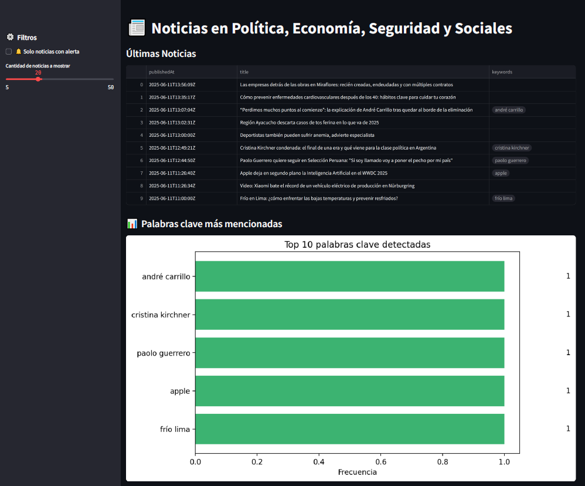
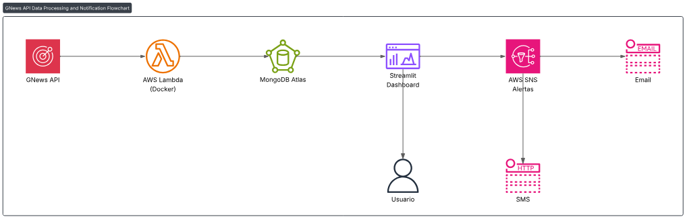
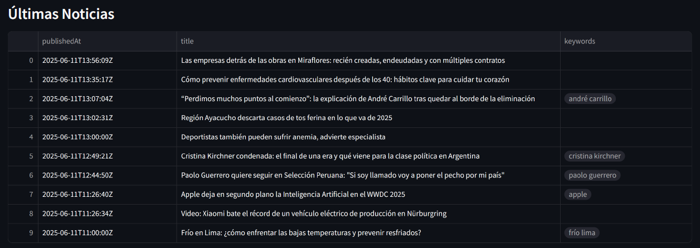
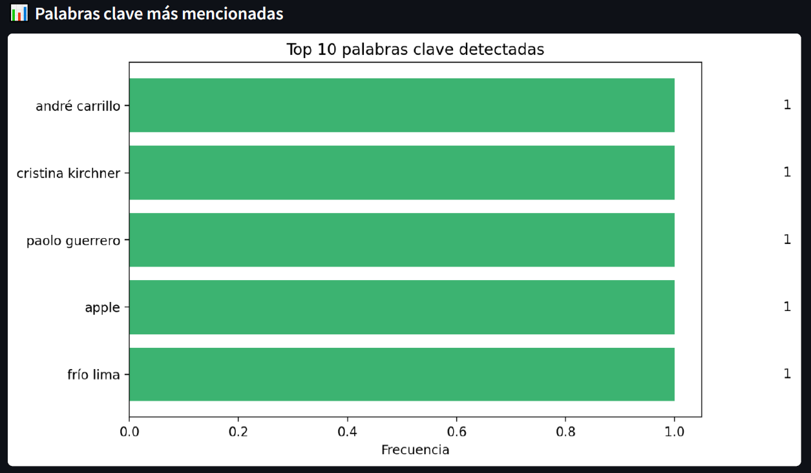

# 📰 News Trends Argentina

Un pipeline automatizado que recolecta noticias político-económicas de Argentina, las analiza con NLP, las almacena en MongoDB Atlas y envía alertas relevantes por AWS SNS. El dashboard visual está disponible vía Streamlit Cloud.



## 🚀 Tecnologías utilizadas

- **AWS Lambda** – Automatización serverless del pipeline
- **AWS SNS** – Envío de alertas
- **AWS ECR** – Imagen Docker de Lambda
- **MongoDB Atlas** – Almacenamiento NoSQL de artículos
- **GNews API** – Fuente de datos de noticias
- **spaCy** – Limpieza y análisis de texto en español
- **Streamlit Cloud** – Visualización del resultado final

📌 Arquitectura general:



## 🖥️ Capturas del dashboard

Vista de noticias recientes:



Palabras clave más frecuentes:



## Configuración

### Usuario IAM y Configuración de AWS CLI
1. Usuario en AWS IAM con los siguientes permisos mínimos:
   - `AmazonEC2ContainerRegistryFullAccess`: Acceso completo a Amazon ECR para crear repositorios, subir y gestionar imágenes de contenedor.

2. Configura AWS CLI con las credenciales de este usuario ejecutando:
```bash
aws configure
```

## 🛠️ Cómo levantar el proyecto

### 🐳 Backend (Lambda + MongoDB Atlas)

1. Clonar el repositorio
Clona este repositorio en tu máquina local o en tu instancia EC2:
```bash
git clone https://github.com/facundocicler/NewsTrends.git
```
```bash
cd NewsTrends
```

2. Construí la imagen Docker:
```bash
docker build -t $REPO_NAME:$IMAGE_TAG .
```
3. Loguearte a ECR
```bash
aws ecr get-login-password --region $AWS_REGION | docker login --username AWS --password-stdin ${AWS_ACCOUNT_ID}.dkr.ecr.${AWS_REGION}.amazonaws.com
```
2. Taggear y subir la imagen a AWS ECR:
```bash
docker tag $REPO_NAME:$IMAGE_TAG ${AWS_ACCOUNT_ID}.dkr.ecr.${AWS_REGION}.amazonaws.com/$REPO_NAME:$IMAGE_TAG
```
```bash
docker push ${AWS_ACCOUNT_ID}.dkr.ecr.${AWS_REGION}.amazonaws.com/$REPO_NAME:$IMAGE_TAG
```

4. Crea un rol IAM para la función Lambda:
   - Crea un nuevo rol IAM en la consola de IAM de AWS.
   - Asigna la política `AWSLambdaBasicExecutionRole` para permitir a la función Lambda escribir registros en CloudWatch Logs.
   - Asigna la política `AmazonSNSFullAccess` para permitir a la función Lambda escribir registros en CloudWatch Logs.

5. Usá esa imagen para una función Lambda con:
* Timeout: 3 min
* Memoria: 512 MB o más
* Trigger diario con EventBridge

6. Agregá el archivo config.json con:
```json
{
  "api_key": "...",
  "mongo_uri": "...",
  "sns_topic_arn": "...",
  "country": "ar",
  "lang": "es"
}
```
## 📊 Streamlit Cloud

1. Subí el código del dashboard a GitHub (dashboard/)

2. En https://streamlit.io/cloud, creá una app
 
3. Pegá los secretos desde .streamlit/secrets.toml

4. Accedé a tu dashboard público en:
```bash
https://TU_USUARIO.streamlit.app/
```

---

### 📎 Estructura del repositorio

```md
## 📁 Estructura del repositorio

news-trends-project/
├── lambda/
│   ├── lambda_function.py
│   ├── cleaner.py
│   ├── analyzer.py
│   ├── notifier.py
│   └── config.json
│
├── docker/
│   └── Dockerfile
│
├── dashboard/
│   ├── app.py
│   ├── requirements.txt
│   └── .streamlit/
│       └── secrets.toml
```

```md
## 👤 Autor

**Facundo Cicler**  
📧 facundocicler@gmail.com  
💼 [LinkedIn](https://www.linkedin.com/in/facundocicler/)  
